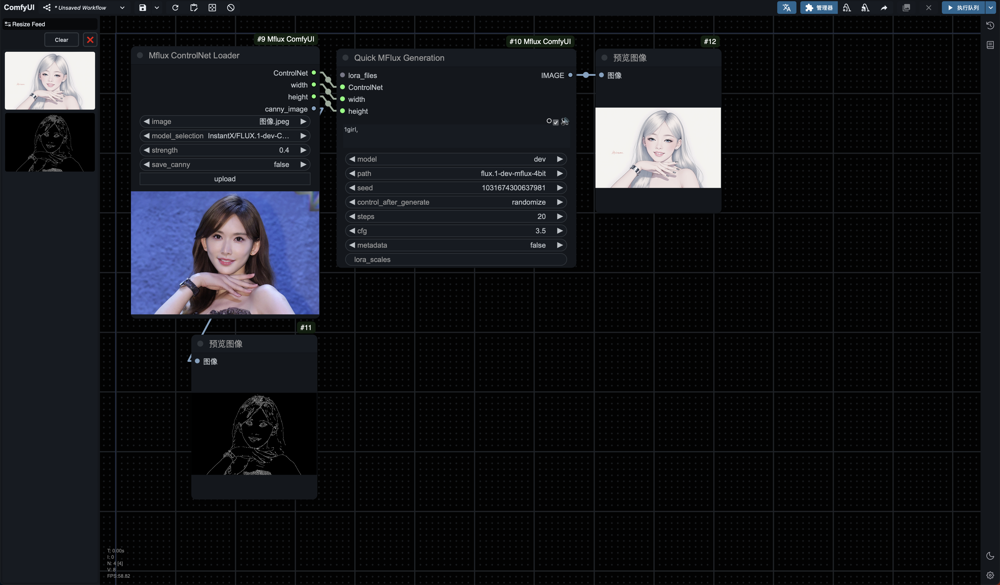

<h1 align="center">Quick Mflux on Comfyui</h1>

      English | <a href="README_zh.md">中文</a>

# Quick Mflux on Comfyui

## Introduction
Simple use of Mflux in ComfyUI, suitable for users who are not familiar with terminal usage, specifically for MacOS.

## Acknowledgements

Thanks to the developers of the [**mflux**](https://github.com/filipstrand/mflux) project, especially the initiator **@filipstrand** and active contributor **@anthonywu**, for making it easier and more efficient for Mac users to generate flux model images. These contributions are truly delightful—thank you!

mflux:  
https://github.com/filipstrand/mflux

Thanks also to **@CharafChnioune**, the author of [**MFLUX-WEBUI**](https://github.com/CharafChnioune/MFLUX-WEBUI), from whom I partially referenced some code. In compliance with the Apache 2.0 license used in his project, I have added license comments in the referenced sections of my code.

## Installation Guide
1. `cd /path/to/your_ComfyUI`
2. Activate the virtual environment
3. `cd custom_nodes`
4. `git clone https://github.com/raysers/Mflux-ComfyUI.git`
5. `pip install mflux==0.3.0`
6. Restart ComfyUI

Alternatively, you can search for "Mflux-ComfyUI" in ComfyUI-Manager for a quick installation.

## Usage Instructions

When creating a new node via right-click:

**Quick MFlux Generation** is located under **Mflux Air**  
**Mflux ControlNet Loader** is located under **Mflux Pro**

Or, double-click on the blank canvas to open the node search box and search directly by node name, using the keyword “Mflux.”

### Workflows

**Mflux Air:**

**Mflux Pro:**

  
Mflux's ControlNet currently supports only Canny.

**Mflux Plus:**

  
Essential for non-native English speakers.

  
Reverse image generation using MiaoshouAI/Florence-2-large-PromptGen-v1.5 vision model.

All these workflows can be directly dragged from the `workflows` folder into ComfyUI.

!!! If nodes are marked in red, use ComfyUI-Manager's "One-Click Install Missing Nodes" feature.  
!!! Please note that all workflows end with preview nodes. These do not automatically save images—you need to manually save the generated image you like, or replace the preview node with a save node.

In the **Quick MFlux Generation** node, if the metadata option is set to true (default is false), the generated images will be saved to **ComfyUI/output/Mflux** along with a JSON file of the same name, which contains almost all the generation parameters for the image.

### Possible Explorations:

**Mflux MAX:**

......

**Mflux Ultra:**

......

I hope experts can share more workflows and contribute to the open-sharing spirit of the internet. Paid knowledge? No, I advocate for open sharing.

## Roadmap

The next goal is to implement Lora, if possible.

## Contributions
I am a novice coder, and this is my first GitHub project. I initially had grand plans, such as implementing mflux’s Lora and ControlNet functionalities (currently, Mflux ControlNet with Canny is implemented), and realizing ComfyUI’s core concept—splitting nodes to help users dive deep into the underlying logic of flux. However, my limited coding skills have constrained my vision. If anyone with expertise could help implement these, I would be very grateful. Greetings to all!

## License
I would like to adopt the MIT license, consistent with the mflux project, as a contribution to open source.
