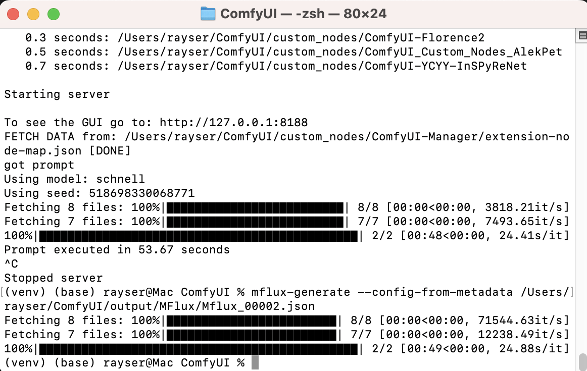
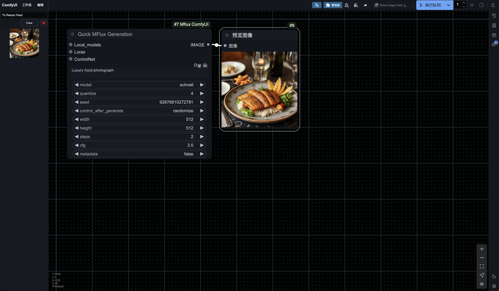
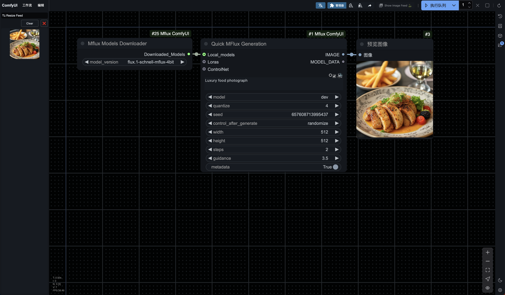
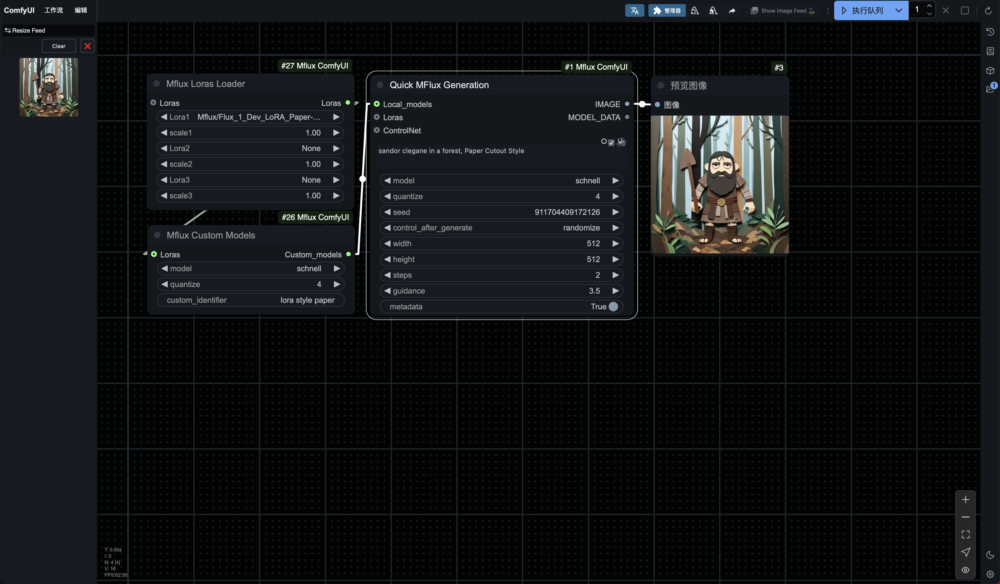
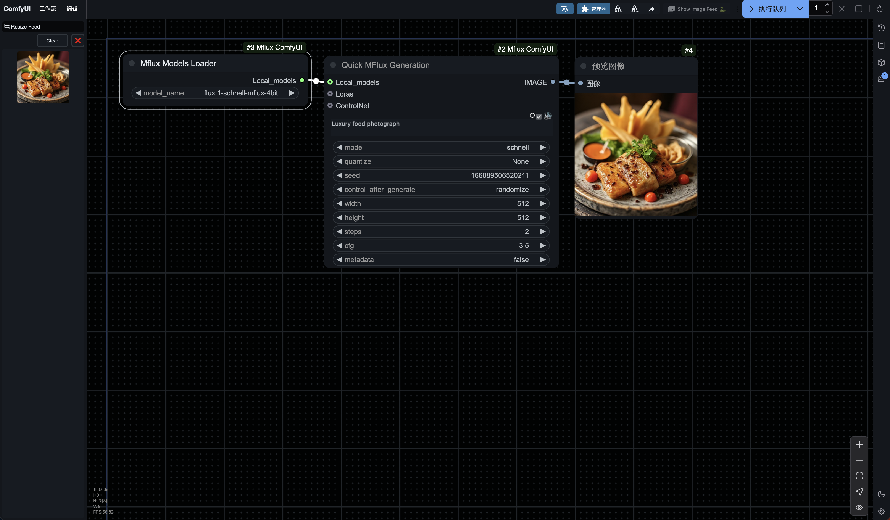
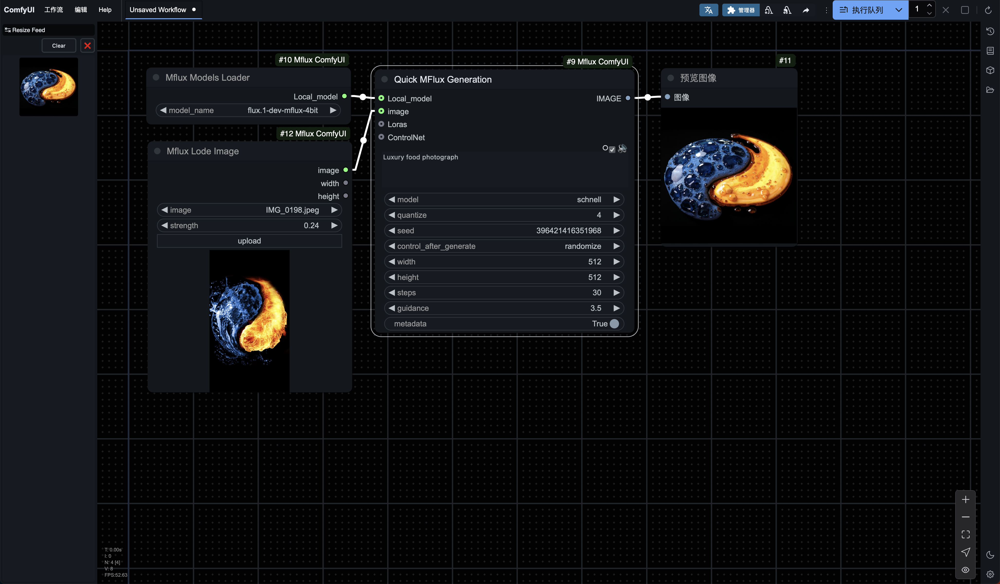
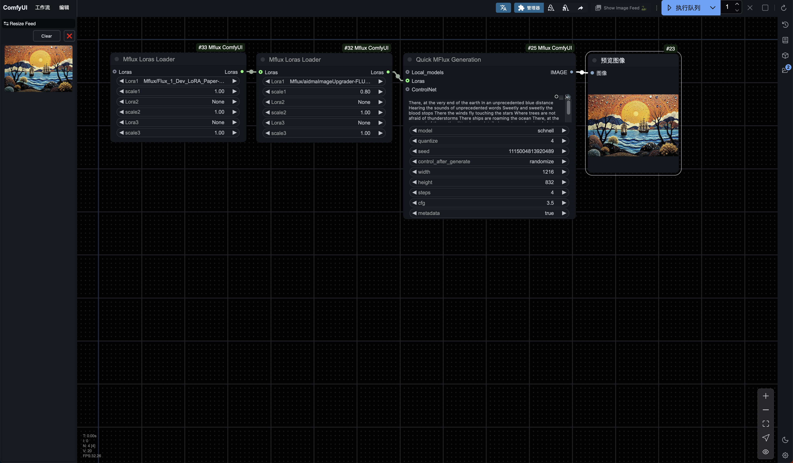
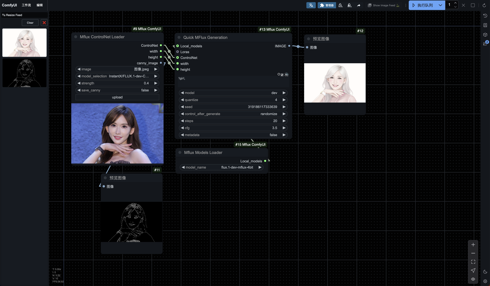
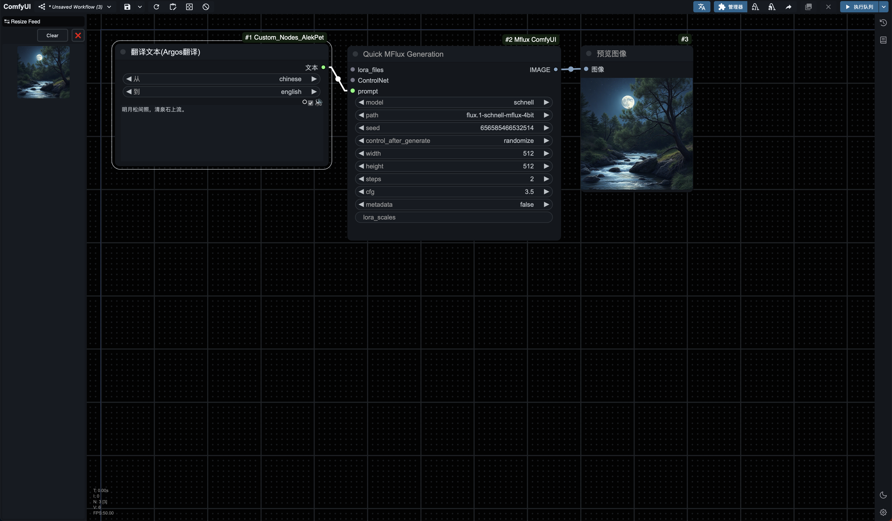
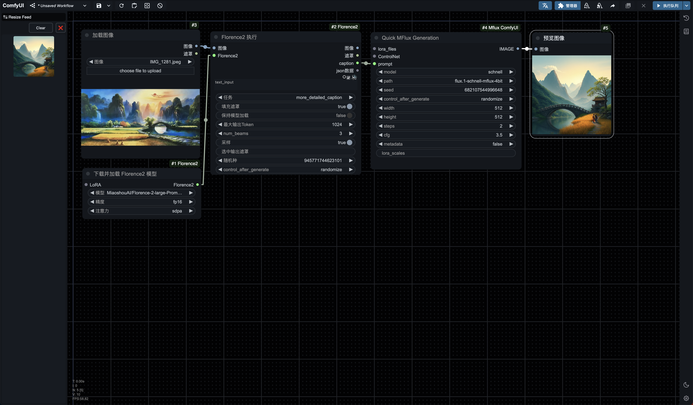

<h1 align="center">Quick Mflux on Comfyui</h1>

      中文 | <a href="README.md">English</a>

# Quick Mflux on Comfyui

## 简介
Mflux在ComfyUI中的简单使用，适合不太懂得使用终端的用户，仅MacOS。

## 特别鸣谢

感谢[**mflux**](https://github.com/filipstrand/mflux)项目的开发者们，特别是项目发起人 **@filipstrand** 和活跃贡献者 **@anthonywu**，是他们让Mac用户实现了更方便高效的flux模型生图，这些贡献着实令人轻松愉悦，谢谢他们！

mflux:
https://github.com/filipstrand/mflux

同时感谢[**MFLUX-WEBUI**](https://github.com/CharafChnioune/MFLUX-WEBUI)的作者 **@CharafChnioune**，我部分参考了他的代码，基于他的项目所使用的Apache 2.0许可证的要求，我在代码中的引用段落添加了许可证注释。

## 安装指南
1. cd /path/to/your_ComfyUI
2. 激活虚拟环境
3. `cd custom_nodes`
4. `git clone https://github.com/raysers/Mflux-ComfyUI.git`
5. `pip install mflux==0.4.1`
6. 重启ComfyUI

或者，从ComfyUI-Manager中直接搜索“Mflux-ComfyUI”来快速安装。

## 更新声明

### **关于本次更新：**

- ControlNet节点集成图像与强度，以与img2img作区分————来自@InformEthics的贡献。

这是本插件第一次有其他贡献者参与更新，谢谢@InformEthics。

### **往期更新回顾：**

- 将失踪的metadata带回来

**Quick MFlux Generation**节点中的metadata默认为True，这将使生成图像被自动保存到**ComfyUI/output/Mflux**下，同时带有与图像同名的JSON文件。

ComfyUI目录中同样可以使用mflux-generate --config-from-metadata的方法加载一份json文件来使用mflux原版完成生图。

示例：

原版的优点是内存回收干净利落，每一次生图完成自动释放内存，打开活动监视器就能看见这种差异。

如果要体验mflux原版，那么可以多一个选择。

- 添加ComfyUI进度条和中断操作功能，点按ComfyUI自带的叉号（取消按钮）即可

- 自由路径

- 图生图

mflux已经更新到0.4.1版本，如果要体验图生图，那么请在ComfyUI中升级：

`pip install --upgrade mflux`

## 使用说明

右键新建节点：

**MFlux/Air**下：

- **Quick MFlux Generation**
- **MFlux Models Loader**
- **MFlux Models Downloader**
- **MFlux Custom Models**

**MFlux/Pro**下：

- **Mflux Img2Img**
- **MFlux Loras Loader**
- **MFlux ControlNet Loader**

或者双击画板空白处调出节点搜索框，直接搜索节点名称，搜索关键字“Mflux”

### **基础路径说明**

量化模型：

**ComfyUI/models/Mflux**

LoRA：

**ComfyUI/models/loras**

我的习惯是在**models/loras**下新建Mflux文件夹，用来检测Mflux所能适配的LORA，统一存放其中，因此在我的示例中，检索出来的应该是Mflux/*******.safetensors

原生完整模型&ControlNet：

**你的用户名/.cache**

虽然当前节点**Mflux Models Downloader**可以实现自动下载，但还是贴出几个量化模型的地址以示感谢：

- [madroid/flux.1-schnell-mflux-4bit](https://huggingface.co/madroid/flux.1-schnell-mflux-4bit)
- [madroid/flux.1-dev-mflux-4bit](https://huggingface.co/madroid/flux.1-dev-mflux-4bit)
- [AITRADER/MFLUX.1-schnell-8-bit](https://huggingface.co/AITRADER/MFLUX.1-schnell-8-bit)
- [AITRADER/MFLUX.1-dev-8-bit](https://huggingface.co/AITRADER/MFLUX.1-dev-8-bit)

当然还有最重要的黑森林原生完整模型：

- [black-forest-labs/FLUX.1-schnell](https://huggingface.co/black-forest-labs/FLUX.1-schnell)
- [black-forest-labs/FLUX.1-dev](https://huggingface.co/black-forest-labs/FLUX.1-dev)

以及来自InstantX团队的FLUX.1-dev-Controlnet-Canny模型：

- [InstantX/FLUX.1-dev-Controlnet-Canny](https://huggingface.co/InstantX/FLUX.1-dev-Controlnet-Canny)

## 流程

### **Mflux Air：**

#### text2img:

这个基础流程将会从Huggingface下载完整版的dev或schnell到`.cache`里，它们都有33G多，可能会给硬盘空间带来负担。

当然使用量化模型将大大节省硬盘空间，如果您想使用量化模型，可以直接连接**Mflux Models Downloader**节点以从Huggingface下载量化模型，比如：

或者你也可以使用预存在.cache里的完整版的黑森林模型通过**Mflux Custom Models**来打造你的专属模型：

比如默认量化版，这和Huggingface下载的基础版量化模型是一样的：

比如LORA叠加版，这可以在叠加LORA后再进行量化，从而使模型成为一种独特模型：

这种LORA定制模型的不足是它本质仍然属于量化模型，你想在**Quick MFlux Generation**里继续叠加Loras的话，它就会报错。

在这里我们可以提取到一个互斥规则：**即LORA与量化模型不能同时使用，只能二选一；**要想实现鱼和熊掌的兼得，只能通过这种量化前的叠加来生成LORA定制模型。

但是，如果你想要快速生成同一种lora风格的多张图片，并且您的机器配置不是很高，比如我的16GB，那么使用这种方法可以当做实现Lora的折中方案，生图完成的时候可以直接删除这种独特模型。

注意**Mflux Custom Models**节点中的custom_identifier不是必填项，如果不需要特定表示作区分，完全可以选择留空。

而无论是下载Huggingface的模型还是自定义专属模型，它们都仅需要**运行一次**，只要你保存了模型，就可以使用**Mflux Models Loader**节点来检索它们，比如：

同时本次更新添加了手动输入路径的选项，或者您可以将**models/Mflux**文件夹清空，那样选择列表中将显示”NONE“，而后你可以在free_path中输入您自己的模型路径。

#### img2img:

具体的使用方式我也仍在探索中，如果有使用心得值得分享，欢迎在issues里开贴探讨。

### **Mflux Pro：**

#### Loras:

图中使用了两个**Mflux Loras Loader**节点，只是为了说明它们是可以串接的，也就是说，理论上可以加载无数Lora...

注意使用Lora的时候不能用**Mflux Models Loader**节点加载量化模型，那样将会报错，这再次验证了上面的那个互斥规则。

也许有一天官方能够解决这个错误，耐心等待吧。

注意：

并非所有的LORA都能兼容Mflux，具体的兼容类型请查看官方主页：

https://github.com/filipstrand/mflux

因此我的习惯是在**models/loras**下新建Mflux文件夹，将Mflux的兼容LoRA统一存放其中.

#### ControlNet:

Mflux的ControlNet，目前仅支持Canny

Ps.本次为了快速生成示例图，我使用dev模型的4步LoRA创建了一个专属模型。

这个4步LoRA模型的优点是它仍然属于DEV模型，因此Guidance参数可以对它生效，而且仅需四步就能出图，又兼具schnell的优点。

### **Mflux Plus：**

英文小白们必备

图像反推再生成，这里使用MiaoshouAI/Florence-2-large-PromptGen-v1.5视觉模型

以上流程均可从workflows文件夹中直接拖入ComfyUI.

！！！节点报红色的话使用ComfyUI-Manager的“一键安装缺失节点”。

！！！请注意流程末端全部使用的是预览节点，不会自动保存，需要自己挑选满意的生成图片手动保存，或者干脆把预览节点换成保存节点。

### 可能的探索

#### **Mflux MAX:**

......

#### **Mflux Ultra:**

......

这里还是希望大佬们多分享工作流程，充分发扬互联网的共享精神，知识付费？不，我主张合作分享，互惠共赢。

## 规划

官网介绍的mfux0.4.x的功能：

- Img2Img支持：引入了基于初始参考图像生成图像的功能。

- 从Metadata生成图像：增加了直接从提供的Metadata生成图像的支持。

- 渐进步输出：可选择输出图像生成过程的每个步骤，允许实时监控。

往期更新已完成Img2Img。此外mfux0.4.x还有键盘中断功能，上次更新也已使用ComfyUI的取消按钮来实现。

本次更新则完成了从Metadata生成图像的功能。

下一步规划是尽量完成其他功能的实现。

无事请多关注官网：

[https://github.com/filipstrand/mflux](https://github.com/filipstrand/mflux)

## 贡献

互动交流即是贡献。

## 许可证
我想采用和mflux项目一致的MIT麻省理工许可，也算为开源贡献一份心力吧。